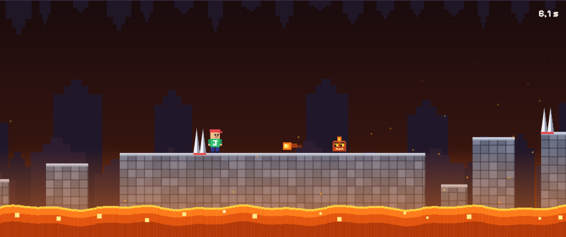
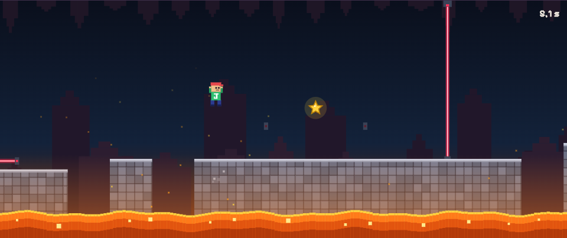
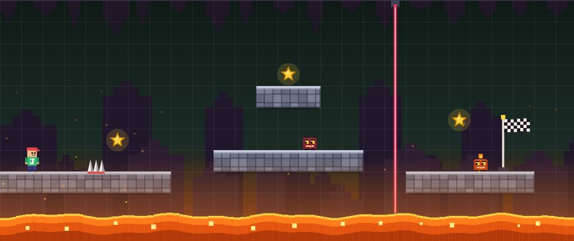

# J y la Lava

A small pixel-art platformer for the browser: help **J** jump across stones over a sea of lava, collect the stars and reach the flag.

A dad-and-son project: the son (a big Minecraft and Roblox fan) invents the rules one idea at a time, and they get built with the help of Claude.



## Play

- **Game:** https://marianobarbiero.github.io/jgame/
- **Beta** (new ideas being tested): https://marianobarbiero.github.io/jgame/beta/

Works on computers, tablets and phones (best held upright). The game text is in Spanish.

## What's inside

- **8 levels:** stepping stones, spikes, rising lava, a spiked ceiling coming down, a closing trap, stompable monsters, fire-spitting monsters and blinking lasers.
- **Stars and diamonds:** grab the 3 stars and reach the flag to win a diamond. Collect 100 diamonds to win the cup.
- **Best times:** a timer for every run, and your best time and stars for each level.
- **Level editor:** build your own level block by block, Minecraft style, then play it.
- **Original chiptune music** for every level, made with the Web Audio API.





## Controls

| | Keyboard | Touch |
|---|---|---|
| Move | ← → or A / D | ◀ ▶ buttons |
| Jump | Space | **SALTAR** button, or tap the game |
| Pause | P or Esc | ⏸ button |
| Restart level | R | "Empezar de nuevo" |

## Run it locally

No build step and no dependencies: just open `index.html` in a browser.

## How it's made

Plain HTML, CSS and JavaScript, everything drawn on a `<canvas>`, with no images and no libraries.

```
index.html     the page
styles.css     styles
version.js     game version
js/            physics, levels, sound, game flow, editor, drawing, game loop
beta/          the same files, for the beta version
```

Progress (diamonds, stars, best times, your level) is saved in the browser's `localStorage`.
